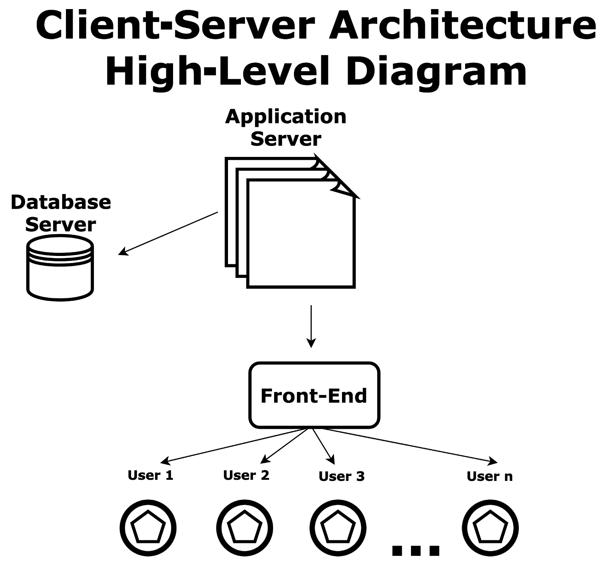

# Harvest CCS Architecture

This document provides an overview of the Harvest Competition Control System architecture.

## System Overview

Harvest CCS is designed as a desktop application that integrates with a backend api and cloud storage. The architecture follows a mono-repo 3 tier client-server model:

- **Client**: Electron-based desktop application (cross-platform)
- **Server**: Python Flask API deployed to AWS Lambda via Zappa
- **Database**: TinyDB with S3 integration for storage in S3 bucket

<p align="center"></p>

## App Architecture

The frontend is built as an Electron application with React.

### Component Structure

```
app/src/
├── main/           # Electron main process code
│   ├── api.js      # API client for backend communication
│   ├── ipc.js      # IPC communication setup
│   └── serial.js   # Serial port communication
├── preload/        # Preload scripts for IPC bridge
└── renderer/       # Renderer process (React app)
    ├── components/ # Reusable UI components
    ├── context/    # React context providers
    ├── store/      # Zustand state management
    ├── utils/      # Utility functions
    └── views/      # Application views/pages
```

> Note: Please refer to the official Electron documentation for more details on their [Process Model](https://www.electronjs.org/docs/latest/tutorial/process-model)

### State Management

The application uses Zustand for state management using slices:

- `settingsSlice`: Application settings
- `teamSlice`: Team management
- `deviceSlice`: Device status tracking
- `roundSlice`: Competition round control
- `taskSlice`: Task definitions and status
- `tournamentSlice`: Tournament bracket management

State is persisted to the backend API and to an S3 bucket.

## HAPI Architecture

The backend is a Python Flask API designed to be deployed to AWS Lambda using Zappa.

### Component Structure

```
hapi/
├── app/                # Flask application
│   ├── middlewares/    # Request middleware
│   ├── routes/         # API routes
│   └── store/          # Data storage adapters
├── requirements.txt    # Python dependencies
└── zappa_settings.json # Zappa deployment config
```

### Data Flow

1. Authentication via Firebase Authentication
2. Data persistence in S3 using TinyDB adapter
3. API endpoints for state synchronization

### Key Endpoints

- `GET /state`: Retrieve the current application state
- `POST /state`: Update the application state

## Authentication and Security

The system uses Firebase Authentication for user management. The flow is:

1. User logs in via Firebase Auth in the Electron app
2. JWT token is obtained and stored in memory
3. Backend API validates the token using Firebase Admin SDK
4. Protected routes require a valid token

## Deployment

- **app**: Electron app packaged for Windows, macOS, and Linux
- **hapi**: Deployed to AWS Lambda using Zappa
